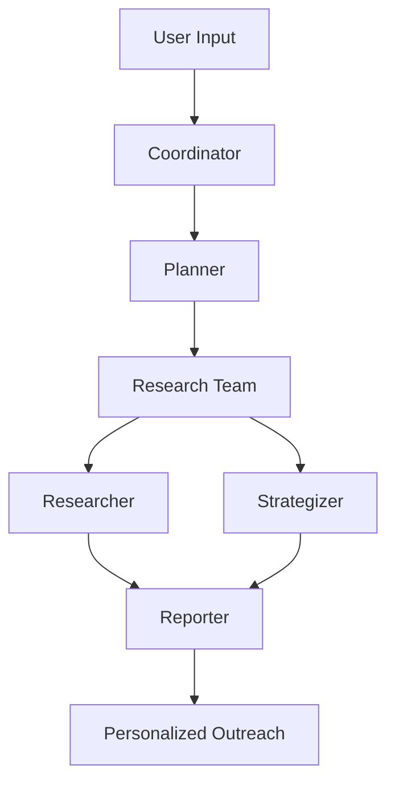

# 👻 Unghost Agent

<div align="center">
  
  
  <h3>Transform Cold Outreach From Ghosted to Irresistible</h3>
  
  [](https://www.python.org/downloads/)
  [](https://nextjs.org/)
  [](https://opensource.org/licenses/MIT)
  [](https://langchain-ai.github.io/langgraph/)
  
  <br/>
  
  **Stop getting ghosted. Start getting responses.**
  
  [Quick Start](#quick-start) • [Demo](#demo) • [Configuration](#configuration) • [Documentation](#documentation)
</div>

---

## What is Unghost Agent?

**Unghost Agent** is your AI-powered cold outreach specialist that transforms generic messages into irresistible, personalized communications. Born from the brilliant insight shared by [Bhavye Khetan](https://x.com/bhavye_khetan/status/1929379775602373012) about AI's potential for personalized outreach, and inspired by [Roy Lee's demonstration](https://x.com/im_roy_lee/status/1936138361011585190) of Cluely's innovative approach to AI-powered hack assistance, Unghost Agent combines advanced prospect intelligence with strategic message crafting to help you break through inbox noise and build meaningful professional relationships.

Unlike template-based outreach tools, Unghost Agent:

- **Researches prospects deeply** using advanced AI tools and public data sources  
- **Crafts personalized messages** that demonstrate genuine research and relevance  
- **Adapts communication style** to match each prospect's preferences and context  
- **Incorporates your professional background** to create authentic, credible outreach  
- **Generates high-converting content** that drives responses and meetings  

Whether you're in sales, business development, recruitment, or networking, Unghost Agent helps you create outreach that feels personal, relevant, and valuable to your recipients.

---

## Quick Start

### Prerequisites

- **Python 3.12+** - [Download](https://www.python.org/downloads/)
- **Node.js 22+** - [Download](https://nodejs.org/en/download/)
- **uv** (recommended) - [Install](https://docs.astral.sh/uv/getting-started/installation/)
- **pnpm** (recommended) - [Install](https://pnpm.io/installation)

### Installation

```bash
# Clone the repository
git clone https://github.com/PeterL-1111/unghost.git
cd unghost

# Install Python dependencies with uv (creates virtual environment automatically)
uv sync

# Install frontend dependencies
cd front && pnpm install && cd ..
```

### Configuration

#### Environment Variables (.env)

```bash
# Copy the example environment file
cp .env.example .env
```

Edit `.env` with your API keys:

```bash
# Search Engine Configuration
SEARCH_API=tavily                    # Required: tavily, brave_search, duckduckgo, arxiv
TAVILY_API_KEY=your_tavily_key       # Get from: https://app.tavily.com/home

# LLM Configuration (choose your provider)
OPENAI_API_KEY=your_openai_key       # OpenAI API key
ANTHROPIC_API_KEY=your_anthropic_key # Anthropic API key

# Optional: RAG Integration
RAG_PROVIDER=ragflow
RAGFLOW_API_URL=http://localhost:9388
RAGFLOW_API_KEY=your_ragflow_key

# Optional: Text-to-Speech
VOLCENGINE_TTS_APPID=your_app_id
VOLCENGINE_TTS_ACCESS_TOKEN=your_token

# Optional: Debugging & Tracing
LANGSMITH_TRACING=true
LANGSMITH_API_KEY=your_langsmith_key
LANGSMITH_PROJECT=unghost-agent
```

#### LLM Configuration (conf.yaml)

```bash
# Copy the example configuration
cp conf.yaml.example conf.yaml
```

Edit `conf.yaml` with your preferred models:

```yaml
# Basic reasoning and text generation
BASIC_MODEL:
  model: "gpt-4o"
  api_key: "${OPENAI_API_KEY}"
  base_url: "https://api.openai.com/v1"

# Advanced reasoning for complex analysis
REASONING_MODEL:
  model: "claude-3-5-sonnet-20241022"
  api_key: "${ANTHROPIC_API_KEY}"
  base_url: "https://api.anthropic.com"

# Vision capabilities for image analysis
VISION_MODEL:
  model: "gpt-4-vision-preview"
  api_key: "${OPENAI_API_KEY}"
  base_url: "https://api.openai.com/v1"
```

### Quick Start Options

#### Web Interface (Recommended)
```bash
# Start both backend and frontend
./bootstrap.sh -d  # macOS/Linux
# or
bootstrap.bat -d  # Windows

# Open http://localhost:3000 in your browser
```

#### Console Mode
```bash
# Run in console for quick testing
uv run main.py "Create personalized cold outreach for John Smith, VP Engineering at TechCorp"
```

#### Docker
```bash
# Run with Docker Compose
docker compose up -d

# Access at http://localhost:3000
```

---

## Demo

### Sample Outreach Scenarios

Try these example prompts to see Unghost Agent in action:

#### Sales Outreach
```
"Create outreach for Sarah Johnson, Head of Marketing at GrowthCorp, to introduce our marketing automation platform"
```

#### Partnership Development
```
"Draft outreach to Michael Chen, VP Business Development at TechStart, for potential integration partnership"
```

#### Talent Acquisition
```
"Create recruiting message for Lisa Wang, Senior Software Engineer at BigTech, for our new AI team role"
```

#### Professional Networking
```
"Draft networking message to Alex Thompson, founder of StartupX, to discuss AI trends in fintech"
```

---

## Architecture

Unghost Agent implements a specialized multi-agent system optimized for cold outreach intelligence:



### Core Components

- **Coordinator**: Manages outreach workflow and user interactions
- **Planner**: Creates strategic research plans for comprehensive prospect intelligence
- **Researcher**: Gathers deep prospect and company intelligence using specialized tools
- **Strategizer**: Formulates outreach strategies and crafts personalized messages
- **Reporter**: Generates comprehensive outreach packages and recommendations

### Specialized Tools

- **LinkedIn Profile Intelligence**: Professional background and network analysis
- **Company Research Engine**: Business context and competitive intelligence
- **Communication Style Analyzer**: Tone preferences from public content
- **Thought Leadership Tracker**: Speaking engagements and publication insights

---

## Key Features

### Deep Prospect Intelligence
- **Professional Background Research**: LinkedIn profiles, career history, recent activities
- **Company Context Analysis**: Industry trends, company news, strategic initiatives  
- **Communication Style Detection**: Tone preferences from public content and interactions
- **Timing Intelligence**: Recent events that make outreach timely and relevant

### AI-Personalized Messaging
- **Multi-Style Tone Generation**: Aggressive, Conservative, Go Nuts, or Friendly approaches
- **Value Proposition Alignment**: Messages tailored to prospect's likely priorities and pain points
- **Professional Background Integration**: Leverage your expertise for authentic credibility
- **Response Psychology**: Crafted to maximize open rates and response probability

### Strategic Outreach Planning
- **Persona Research**: Comprehensive prospect profiling with behavioral insights
- **Strategy Formulation**: Optimal approach recommendations based on prospect analysis
- **Message Drafting**: Complete outreach sequences with subject lines and follow-ups
- **Credibility Building**: Social proof and connection opportunities identification

---

## Configuration

### API Keys Required

| Service | Purpose | Get Your Key | Required |
|---------|---------|--------------|----------|
| **Tavily** | Web search & research | [app.tavily.com](https://app.tavily.com/home) | ✅ Yes |
| **OpenAI** | GPT models | [platform.openai.com](https://platform.openai.com) | ✅ Yes* |
| **Anthropic** | Claude models | [console.anthropic.com](https://console.anthropic.com) | ✅ Yes* |

*At least one LLM provider required

### Configuration Files

#### Environment Variables (.env)
Controls runtime behavior and API keys.

#### LLM Models (conf.yaml)
Defines which models to use for different tasks:

- **BASIC_MODEL**: General text generation and reasoning
- **REASONING_MODEL**: Complex analysis and strategic thinking
- **VISION_MODEL**: Image analysis capabilities

### Advanced Configuration

For detailed configuration options, see our [Configuration Guide](docs/configuration_guide.md).

---

## Development

### Running Tests
```bash
# Run the full test suite
make test

# Run with coverage
make coverage

# Run specific tests
pytest tests/integration/test_outreach_workflow.py
```

### Code Quality
```bash
# Format and lint code
make format
make lint
```

### Debugging with LangGraph Studio

Visualize and debug agent workflows in real-time:

```bash
# macOS
uvx --refresh --from "langgraph-cli[inmem]" --with-editable . --python 3.12 langgraph dev --allow-blocking

# Windows/Linux
pip install -e .
pip install -U "langgraph-cli[inmem]"
langgraph dev
```

Access Studio UI at: https://smith.langchain.com/studio/?baseUrl=http://127.0.0.1:2024

---

## Docker Deployment

### Quick Start with Docker
```bash
# Build and run with Docker Compose
docker compose up -d

# Access at http://localhost:3000
```

### Manual Docker Build
```bash
# Build the image
docker build -t unghost-agent .

# Run with environment file
docker run -d -p 8000:8000 --env-file .env unghost-agent
```

---

## Additional Features

Beyond cold outreach, Unghost Agent includes powerful content creation capabilities:

### Podcast Generation
Convert research into audio content:
```bash
curl -X POST "http://localhost:8000/api/podcast/generate" \
  -H "Content-Type: application/json" \
  -d '{"content": "Your research content here"}'
```

### Presentation Creation
Generate PowerPoint from research:
```bash
curl -X POST "http://localhost:8000/api/ppt/generate" \
  -H "Content-Type: application/json" \
  -d '{"content": "Your research content here"}'
```

### Text-to-Speech
Convert messages to audio:
```bash
curl -X POST "http://localhost:8000/api/tts" \
  -H "Content-Type: application/json" \
  -d '{"text": "Your outreach message here"}' \
  --output message.mp3
```

---

## Documentation

- [Configuration Guide](docs/configuration_guide.md) - Detailed setup instructions
- [FAQ](docs/FAQ.md) - Common questions and troubleshooting
- [MCP Integrations](docs/mcp_integrations.md) - External tool integrations

---

## FAQ

### General Questions

**Q: What makes Unghost Agent different from other outreach tools?**
A: Unghost Agent combines deep AI-powered prospect research with strategic message crafting. Instead of templates, it creates truly personalized messages based on comprehensive prospect intelligence.

**Q: Can I use my own professional background for credibility?**
A: Yes! Unghost Agent includes a user background feature that incorporates your professional experience to create authentic, credible outreach that sounds natural coming from you.

**Q: What data sources does Unghost Agent use?**
A: Unghost Agent uses only publicly available information from web searches, LinkedIn profiles, company websites, social media, and published content. No private data access.

### Technical Questions

**Q: Which LLM models are supported?**
A: Unghost Agent supports OpenAI (GPT-4), Anthropic (Claude), and most models through LiteLLM integration. See the configuration guide for setup details.

**Q: Can I customize the outreach style?**
A: Yes! Choose from four outreach styles: Aggressive (direct), Conservative (diplomatic), Go Nuts (creative), or Friendly (relationship-focused).

**Q: Is there an API for integration?**
A: Yes, Unghost Agent provides a full REST API for integration with your existing tools and workflows.

---

## License

This project is licensed under the [MIT License](./LICENSE).

---

## Acknowledgments

Unghost Agent builds upon the foundation of DeerFlow and the incredible work of the open-source community.

### Inspiration & Leadership

**Unghost Agent** is maintained by **Peter Liu** ([@heypeter1111](https://twitter.com/heypeter1111)), who was inspired by [Bhavye Khetan's insightful tweet](https://x.com/bhavye_khetan/status/1929379775602373012) about AI's potential for personalized outreach. This insight sparked the vision to transform generic cold outreach into meaningful, personalized communication.

### Technical Foundation

Special thanks to **Henry Li and the original DeerFlow contributors** for their foundational work that made Unghost Agent possible. Their vision for AI-powered research provided the technical foundation we've specialized for cold outreach.

### Core Technologies

- **[LangChain](https://github.com/langchain-ai/langchain)**: Framework powering our LLM interactions and agent orchestration
- **[LangGraph](https://github.com/langchain-ai/langgraph)**: Multi-agent workflow architecture enabling sophisticated outreach intelligence
- **[Novel](https://github.com/steven-tey/novel)**: Notion-style editor supporting our content creation features
- **[RAGFlow](https://github.com/infiniflow/ragflow)**: Private knowledge base integration for enhanced research capabilities

---

<div align="center">
  <h3>Ready to stop getting ghosted?</h3>
  <p><strong>Transform your cold outreach from ignored to irresistible with Unghost Agent.</strong></p>
  
  <br/>
  
  <a href="https://github.com/PeterL-1111/unghost" target="_blank">
    
  </a>
  
  <br/><br/>
  
  <strong>Follow [@heypeter1111](https://twitter.com/heypeter1111) for updates and outreach tips</strong>
</div>
